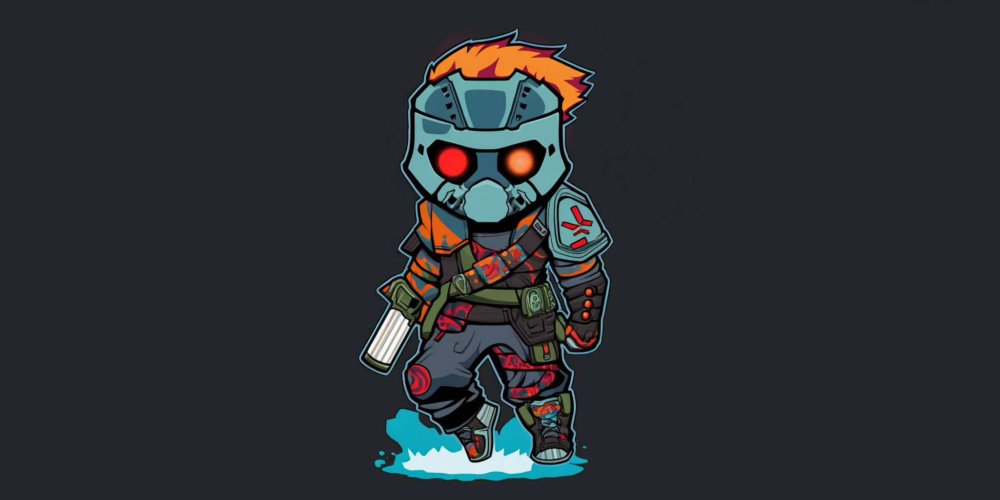

# Rebel Scum: A Savegame Manager for Cataclysm: Dark Days Ahead

## About

Rebel Scum is a savegame manager for the game [Cataclysm: Dark Days Ahead](https://cataclysmdda.org/) written in Python 3 for those of us who get too attached to our characters, like to experiment… or any other reason you might have to want to go save scumming.

It is designed to be cross-platform and to work with the latest stable version of the game.

## Install
1. Run the program, which will create a YAML config file under the user's home directory '~/.rebelscum'.
2. Edit the config file to change file paths as needed.

## Run
Call the program in the command line and select your desired options. Save and restore your games with ease.

## License
This code is licensed under [Creative Commons Attribution-NonCommercial-ShareAlike 4.0 International (CC BY-NC-SA 4.0)](https://creativecommons.org/licenses/by-nc-sa/4.0/).

## Credits

Cristiano Dias, with help from friendly neighborhood ChatGPT.